# 🗺️ Mapa Mental - desenv-web-em-html5-css-javascript-e-php

Este é um mapa mental interativo da estrutura de pastas. Utilize-o para navegar facilmente pelo conteúdo.

## 📊 Estrutura do Diretório

```mermaid
flowchart TD
  root[🗂️ desenv-web-em-html5-css-jav...]
  root_anki_0[anki]
  root_anotacoes_1[anotacoes]
  root_exercicios_2[exercicios]
  root_simulados_3[simulados]
  root_README.md_4[📄 README.md]
  root --> root_anki_0
  root --> root_anotacoes_1
  root --> root_exercicios_2
  root --> root_simulados_3
  root --> root_README.md_4
```

## 📋 Informações

- **Caminho:** `/app/2025-2-Semestre/desenv-web-em-html5-css-javascript-e-php`
- **Gerado em:** 26/08/2025 às 01:47:34
- **Ferramenta:** Gerador de Mapas Mentais v1.3

## 🔍 Como usar

1. **Visualização:** O mapa mental mostra a hierarquia de pastas e arquivos principais.
2. **Navegação:** Use a estrutura para localizar rapidamente o conteúdo desejado.

---
*Mapa mental gerado automaticamente - Não edite manualmente este arquivo*
