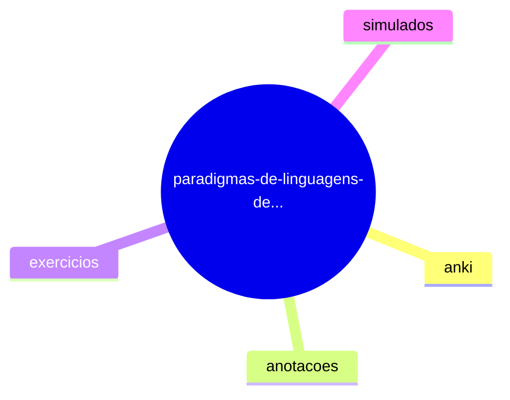

# 🗺️ Mapa Mental - paradigmas-de-linguagens-de-programacao-em-python

Este é um mapa mental interativo da estrutura de pastas. Utilize-o para navegar facilmente pelo conteúdo.

## 📊 Estrutura do Diretório

## 📋 Informações

- **Caminho:** `/app/2025-2-Semestre/paradigmas-de-linguagens-de-programacao-em-python`
- **Gerado em:** 26/08/2025 às 02:01:19
- **Ferramenta:** Gerador de Mapas Mentais v1.5

## 🔍 Como usar

1. **Visualização:** O mapa mental mostra a hierarquia de pastas e arquivos principais.
2. **Navegação:** Use a estrutura para localizar rapidamente o conteúdo desejado.

---
*Mapa mental gerado automaticamente - Não edite manualmente este arquivo*
