# 🗺️ Mapa Mental - app

Este é um mapa mental interativo da estrutura de pastas. Utilize-o para navegar facilmente pelo conteúdo.

## 📊 Estrutura do Diretório

```mermaid
flowchart TD
  root[🗂️ app]
  root_2025-2-Semestre_0[2025-2-Semestre]
  root_2025-2-Semestre_0_arquitetura-de-computadores_0[arquitetura-de-computadores]
  root_2025-2-Semestre_0_arquitetura-de-computadores_0_anki_0[anki]
  root_2025-2-Semestre_0_arquitetura-de-computadores_0_anotacoes_1[anotacoes]
  root_2025-2-Semestre_0_arquitetura-de-computadores_0_exercicios_2[exercicios]
  root_2025-2-Semestre_0_arquitetura-de-computadores_0_simulados_3[simulados]
  root_2025-2-Semestre_0_desenv-web-em-html5-css-jav..._1[desenv-web-em-html5-css-jav...]
  root_2025-2-Semestre_0_desenv-web-em-html5-css-jav..._1_anki_0[anki]
  root_2025-2-Semestre_0_desenv-web-em-html5-css-jav..._1_anotacoes_1[anotacoes]
  root_2025-2-Semestre_0_desenv-web-em-html5-css-jav..._1_exercicios_2[exercicios]
  root_2025-2-Semestre_0_desenv-web-em-html5-css-jav..._1_simulados_3[simulados]
  root_2025-2-Semestre_0_introducao-a-programacao-de..._2[introducao-a-programacao-de...]
  root_2025-2-Semestre_0_introducao-a-programacao-de..._2_anki_0[anki]
  root_2025-2-Semestre_0_introducao-a-programacao-de..._2_anotacoes_1[anotacoes]
  root_2025-2-Semestre_0_introducao-a-programacao-de..._2_exercicios_2[exercicios]
  root_2025-2-Semestre_0_introducao-a-programacao-de..._2_simulados_3[simulados]
  root_2025-2-Semestre_0_paradigmas-de-linguagens-de..._3[paradigmas-de-linguagens-de...]
  root_2025-2-Semestre_0_paradigmas-de-linguagens-de..._3_anki_0[anki]
  root_2025-2-Semestre_0_paradigmas-de-linguagens-de..._3_anotacoes_1[anotacoes]
  root_2025-2-Semestre_0_paradigmas-de-linguagens-de..._3_exercicios_2[exercicios]
  root_2025-2-Semestre_0_paradigmas-de-linguagens-de..._3_simulados_3[simulados]
  root_2025-2-Semestre_0_requisitos-de-sistemas_4[requisitos-de-sistemas]
  root_2025-2-Semestre_0_requisitos-de-sistemas_4_anki_0[anki]
  root_2025-2-Semestre_0_requisitos-de-sistemas_4_anotacoes_1[anotacoes]
  root_2025-2-Semestre_0_requisitos-de-sistemas_4_exercicios_2[exercicios]
  root_2025-2-Semestre_0_requisitos-de-sistemas_4_simulados_3[simulados]
  root_2025-2-Semestre_0_README.md_5[📄 README.md]
  root_anki_prompts_1[anki_prompts]
  root_anki_prompts_1_arquitetura-de-computadores..._0[📁 arquitetura-de-computadores...]
  root_generate_anki_prompts.py_2[📁 generate_anki_prompts.py]
  root_generate_mindmap.py_3[📁 generate_mindmap.py]
  root_README-Docker.md_4[📄 README-Docker.md]
  root_README-Setup-Semestre.md_5[📄 README-Setup-Semestre.md]
  root_README.md_6[📄 README.md]
  root --> root_2025-2-Semestre_0
  root_2025-2-Semestre_0 --> root_2025-2-Semestre_0_arquitetura-de-computadores_0
  root_2025-2-Semestre_0_arquitetura-de-computadores_0 --> root_2025-2-Semestre_0_arquitetura-de-computadores_0_anki_0
  root_2025-2-Semestre_0_arquitetura-de-computadores_0 --> root_2025-2-Semestre_0_arquitetura-de-computadores_0_anotacoes_1
  root_2025-2-Semestre_0_arquitetura-de-computadores_0 --> root_2025-2-Semestre_0_arquitetura-de-computadores_0_exercicios_2
  root_2025-2-Semestre_0_arquitetura-de-computadores_0 --> root_2025-2-Semestre_0_arquitetura-de-computadores_0_simulados_3
  root_2025-2-Semestre_0 --> root_2025-2-Semestre_0_desenv-web-em-html5-css-jav..._1
  root_2025-2-Semestre_0_desenv-web-em-html5-css-jav..._1 --> root_2025-2-Semestre_0_desenv-web-em-html5-css-jav..._1_anki_0
  root_2025-2-Semestre_0_desenv-web-em-html5-css-jav..._1 --> root_2025-2-Semestre_0_desenv-web-em-html5-css-jav..._1_anotacoes_1
  root_2025-2-Semestre_0_desenv-web-em-html5-css-jav..._1 --> root_2025-2-Semestre_0_desenv-web-em-html5-css-jav..._1_exercicios_2
  root_2025-2-Semestre_0_desenv-web-em-html5-css-jav..._1 --> root_2025-2-Semestre_0_desenv-web-em-html5-css-jav..._1_simulados_3
  root_2025-2-Semestre_0 --> root_2025-2-Semestre_0_introducao-a-programacao-de..._2
  root_2025-2-Semestre_0_introducao-a-programacao-de..._2 --> root_2025-2-Semestre_0_introducao-a-programacao-de..._2_anki_0
  root_2025-2-Semestre_0_introducao-a-programacao-de..._2 --> root_2025-2-Semestre_0_introducao-a-programacao-de..._2_anotacoes_1
  root_2025-2-Semestre_0_introducao-a-programacao-de..._2 --> root_2025-2-Semestre_0_introducao-a-programacao-de..._2_exercicios_2
  root_2025-2-Semestre_0_introducao-a-programacao-de..._2 --> root_2025-2-Semestre_0_introducao-a-programacao-de..._2_simulados_3
  root_2025-2-Semestre_0 --> root_2025-2-Semestre_0_paradigmas-de-linguagens-de..._3
  root_2025-2-Semestre_0_paradigmas-de-linguagens-de..._3 --> root_2025-2-Semestre_0_paradigmas-de-linguagens-de..._3_anki_0
  root_2025-2-Semestre_0_paradigmas-de-linguagens-de..._3 --> root_2025-2-Semestre_0_paradigmas-de-linguagens-de..._3_anotacoes_1
  root_2025-2-Semestre_0_paradigmas-de-linguagens-de..._3 --> root_2025-2-Semestre_0_paradigmas-de-linguagens-de..._3_exercicios_2
  root_2025-2-Semestre_0_paradigmas-de-linguagens-de..._3 --> root_2025-2-Semestre_0_paradigmas-de-linguagens-de..._3_simulados_3
  root_2025-2-Semestre_0 --> root_2025-2-Semestre_0_requisitos-de-sistemas_4
  root_2025-2-Semestre_0_requisitos-de-sistemas_4 --> root_2025-2-Semestre_0_requisitos-de-sistemas_4_anki_0
  root_2025-2-Semestre_0_requisitos-de-sistemas_4 --> root_2025-2-Semestre_0_requisitos-de-sistemas_4_anotacoes_1
  root_2025-2-Semestre_0_requisitos-de-sistemas_4 --> root_2025-2-Semestre_0_requisitos-de-sistemas_4_exercicios_2
  root_2025-2-Semestre_0_requisitos-de-sistemas_4 --> root_2025-2-Semestre_0_requisitos-de-sistemas_4_simulados_3
  root_2025-2-Semestre_0 --> root_2025-2-Semestre_0_README.md_5
  root --> root_anki_prompts_1
  root_anki_prompts_1 --> root_anki_prompts_1_arquitetura-de-computadores..._0
  root --> root_generate_anki_prompts.py_2
  root --> root_generate_mindmap.py_3
  root --> root_README-Docker.md_4
  root --> root_README-Setup-Semestre.md_5
  root --> root_README.md_6
```

## 📋 Informações

- **Caminho:** `/app`
- **Gerado em:** 26/08/2025 às 01:47:34
- **Ferramenta:** Gerador de Mapas Mentais v1.3

## 🔍 Como usar

1. **Visualização:** O mapa mental mostra a hierarquia de pastas e arquivos principais.
2. **Navegação:** Use a estrutura para localizar rapidamente o conteúdo desejado.

---
*Mapa mental gerado automaticamente - Não edite manualmente este arquivo*
